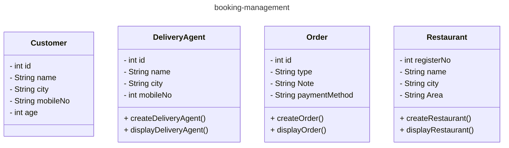

# inheritance-booking-management-project
inheritance-booking-management-project

## **Project Overview**

The Core Java inheritance-booking-management-project is a basic Java application that demonstrates a booking management system. It utilizes object-oriented programming principles and simulates the interactions between customers, delivery agents, restaurants, and orders.

## **Features**

- Manage bookings for customers and restaurants.
- Simulate delivery agent assignments.
- Order and customer management using Java models.
- Simple and intuitive structure for learning and demonstration.

## **Installation and Setup**
- Prerequisites
- Java Development Kit (JDK) 21.
- An Integrated Development Environment (IDE) such as IntelliJ IDEA or Eclipse.
- Git (optional, for version control).

## **Steps**
- Clone the repository:
  ```shell
   git clone %%% "git@github.com:shreyamahalle/inheritance-booking-management-project.git" 
- Navigate to the project directory:
- cd core-java-if-booking-project
- Open the project in your preferred IDE.
- Compile and run the application:
- Locate Main.java.
- Run the file to start the application.

## **Code Structure**  
## **Packages Structure**
- com.booking.using.dowhile: Contains the main application logic (BookingDemoDoWhile.java).
- com.booking.using.dowhile.model: Includes the model classes:
  - Customer.java
  - DeliveryAgent.java
  - Order.java
  - Restaurant.java
- package names: com.booking.Customer.model
- package names: com.booking.DeliveryAgent.model
- package names: com.booking.Order.model
- package names: com.booking.Restaurant.model
- package names: com.booking.BookingDemoDoWhile.service

## **Functionality**
1. **Customer**
2. **DeliveryAgent**
3. **Order**
4. **Restaurant**


## **📝 Database Schema (POJO Classes)**
| **Entity**          | **Attributes** |
|---------------------|----------------------------------------------------------|
| **Customer**           | user id, name, username,monbileNo,city,area |
| **DeliveryAgent**          | id, name, city, mobileNo |
| **Order**         | id, name, city, mobileNo |
| **Restaurant**        |registerNo, name, City, Area |

---


## ** Class Diagram **



